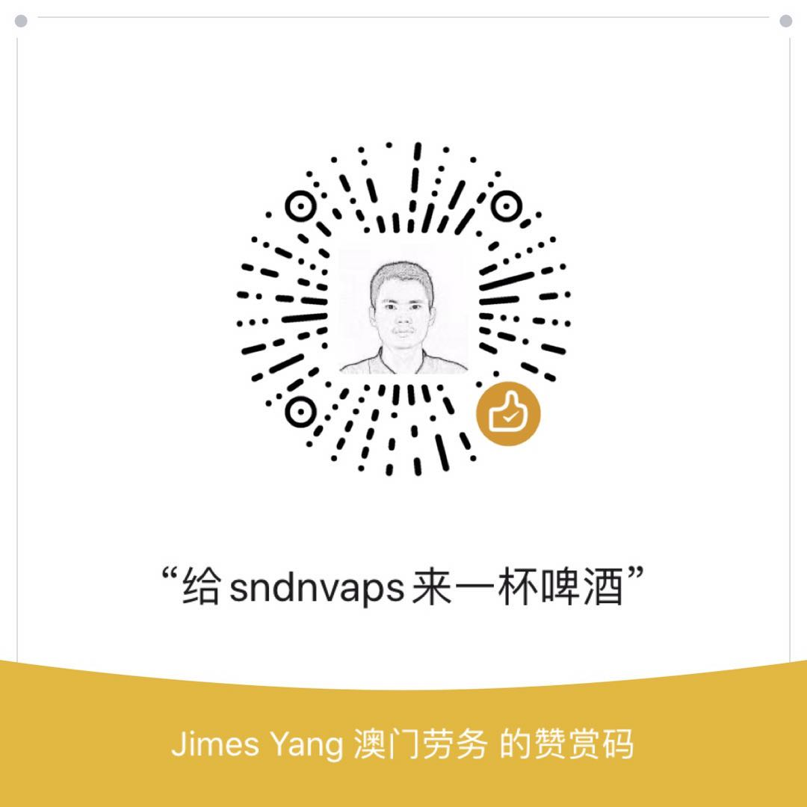

# ebookdownloader
网文下载器

 [](https://github.com/sndnvaps/ebookdownloader/blob/master/LICENSE)

[](https://travis-ci.org/sndnvaps/ebookdownloader)[](https://github.com/sndnvaps/ebookdownloader/releases)[](https://github.com/sndnvaps/ebookdownloader/releases)

[](https://paypal.me/sndnvaps)


[](https://godoc.org/github.com/sndnvaps/ebookdownloader/)

# ebookdl 网文下载器，go语言版本

  ## 安装方法
  ```bash
  go get github.com/sndnvaps/ebookdownloader/cli
  go get github.com/sndnvaps/ebookdownloader/qtgui
  go get github.com/sndnvaps/ebookdownloader/http-server
  ```
  ## 使用方法
  ```bash
  .\ebookdownloader.exe --bookid=0_642 --txt #只生成txt文本
  .\ebookdownloader.exe --bookid=0_642 --mobi #只生成mobi电子书
  .\ebookdownloader.exe --bookid=0_642 --txt --mobi #生成txt 和 mobi
  .\ebookdownloader.exe --bookid=0_642 --txt --awz3 #生成txt 和 awz3
  .\ebookdownloader.exe --proxy="http://proxyip:proxyport" --bookid=0_642 --mobi #生成mobi电子书，在下载章节的过程中使用 Proxy
  .\ebookdownloader.exe --ebhost=xsbiquge.com --bookid=0_642 --txt --mobi #使用xsbiquge.com做为下载源，生成txt 和 mobi
  .\ebookdownloader.exe --ebhost=999xs.com --bookid=0_642 --txt --mobi #使用999xs.com做为下载源，生成txt 和 mobi
   .\ebookdownloader.exe --ebhost=999xs.com --bookid=0_642 --txt --mobi --meta #使用999xs.com做为下载源，生成txt,mobi电子书，并生成meta.json文件于小说目录当中
  .\ebookdownloader.exe --ebhost=23us.la --bookid=127064 --pv #新功能，用于打印小说的分卷信息，此时不下载小说任何内容
  .\ebookdownloader.exe --bookid=0_0642 --json #生成json格式的小说数据
  .\ebookdownloader.exe conv --json=".\outputs\我是谁-sndnvaps\我是谁-sndnvaps.json" --txt --mobi #新功能，转换json格式到txt,mobi格式
  .\ebookdownloader.exe --help #显示帮助信息
  ```

  ## 依赖程序 
    1. kindlegen.exe 支持windows平台
    2. kindlegenLinux 支持Linux 平台
    3. kindlegenMac 支持 Mac平台
    4. cli 项目只需要当前目录存在 ./tools/kindlegen（根据不同的平台，名字有所变化）即可运行
    5. qemu-i386-static-armhf 支持在linux arm平台上运行 kindlegenLinux
    6. qemu-i386-static-arm64 支持在linux arm64平台上运行 kindlegenLinux
    7. http-server 项目依赖：
          github.com/ajvb/kala 项目，用于任务控制和管理
          kala需要与ebookdownloader_cli运行在同一个目录里面
    8. qtgui项目信赖
          goqt
          qt
          gcc
          https://github.com/akavel/rsrc ,用于生成windows系统中的图标
    9. chromedp 项目，用于捉取小说封面
           需要安装chrome浏览器，做支持

  ## 后端服务器 API接口
    主要目的是部署在vps上面，就可以方便随时下载小说了
   API接口文档
[ebookdownloader_http_api](http-server/ebookdownloader_http_api.md)

配置文件[ebdl_conf.ini](conf/ebdl_conf.ini)

  ## 懒人模式，直接下载编译好的程序
  
  墙里面使用gitee

  [gitee ebookdownloader release page](https://gitee.com/sndnvaps/ebookdownloader/releases "https://gitee.com/sndnvaps/ebookdownloader/releases")

墙外面使用github

  [github ebookdownloader release page](https://github.com/sndnvaps/ebookdownloader/releases "https://github.com/sndnvaps/ebookdownloader/releases")

---------------------


## ❤️ 赞助
如果你觉得EbookDownloader项目对你有帮助。你可以给我来一杯啤酒！

| PayPal打赏 | 微信打赏Pay |
| :-: | :-: |
| <a href="https://paypal.me/sndnvaps"> paypal.me/sndnvaps </a>  |  |


-------------

  ## 支持的小说网站

  网站名 | 网址 | 是否支持 | 备注 |
  :-: | :-: | :-: | :-: |
  笔趣阁 | <s>https://www.xsbiquge.com/</s> | × | 网站改名 |
  笔趣阁 | <s>https://www.vbiquge.com/</s>|  × | 网站改名 |
  笔趣阁 | <s>https://www.xxbiquge.net/</s> | × | 网站改名 |
  笔趣阁 | https://www.biqufan.com/ | √ |
  笔趣阁 | <s>https://www.biduo.cc/</s> |  × | 网站改名 |
  笔趣阁 | https://www.biduoxs.com/ | √ |
  笔趣阁 | https://www.biquwu.cc/ | √ | 网站的速度比较慢 |
  笔趣阁 | http://www.biqugse.com/ | √ | 
  笔趣阁 | https://www.biquge.so/ |  | 准备添加支持 |
  西西文学网 | http://www.xixiwx.com/ | √ |
  999小说 | <s> https://www.999xs.com/</s> | × | 网站改名 |
  899zw小说 | https://www.899zw.com/ | √ |
  顶点小说网 | https://www.booktxt.net/ | √ |
  顶点小说网 | <s>https://www.23us.la</s> | × | 因为网站原因无法打开，暂定无法使用 |

------------

  ## 更新日志

  [CHANGELOG](./CHANGELOG "日志文件")

  -----------

  ## To Do List

     [√]  1. 添加生成封面功能
     [√]  2. 添加不同平台的接口实现
     [√]  3. 添加生成二级目录的方法(已经添加相应的实例)
     [√]  4. 添加界面版本gui
     [√]  5. 添加http-server,做为后端
     [√]  6. 添加linux arm,arm64平台支持
     [√]  7. 需要限制并发数量，因为vps性能有限 -> 目前限制的并发数量为(300+49)*2 = 698
     [√]  8. 使用boltdb记录小说数据（小说下载网站，bookid,uuid->NewV5格式，cover.jpg,mobi,azw3,txt,epub等位置及md5验证信息）
     [√]  9. 添加https://www.biduo.cc/ 小说网站支持
     [√]  10. 添加 https://www.booktxt.net/ 顶点小说网支持
     [√]  11. 添加 https://www.biquwu.cc/ 笔趣阁小说网支持
     [√]  12. 添加处理 作者，书名中包含的特殊字符串的方法
     [√]  13. 使用goqt对界面进行重写
     [ ]  14. 更新顶点小说 23us.la地址为23us.lol ->并重写其爬虫规则
     [√]  15. 打包需要用到的资源到程序中，减少目录数量，kindlegen程序因为技术和安全性考虑，暂不封装到go程序中
     [√]  16. 减少程序运行时的依赖，尝试使用 github.com/andlabs/ui来构建gui界面
